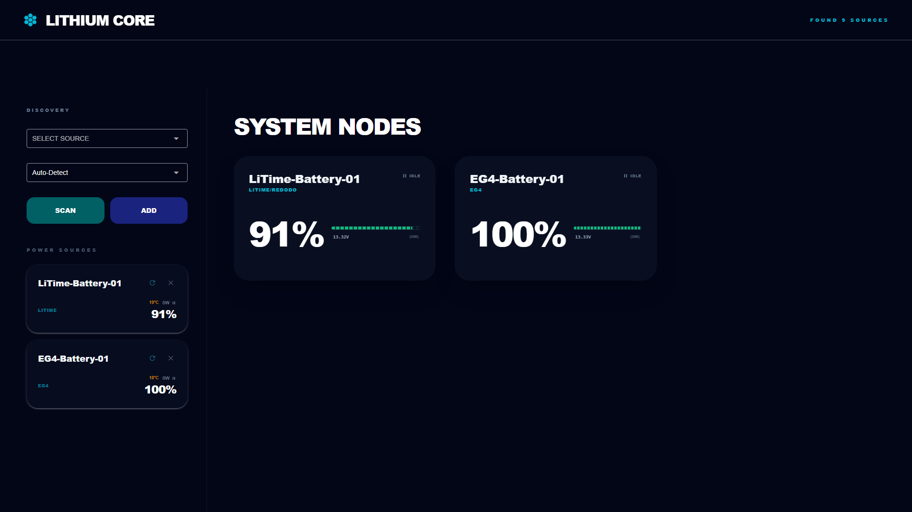
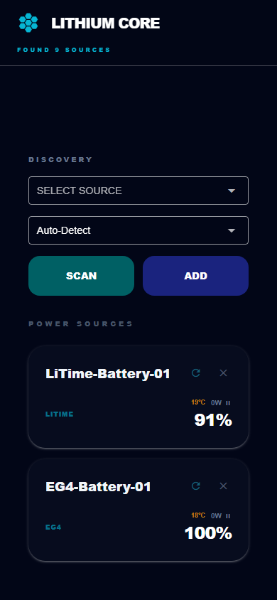

# Lithium Core

A cross-platform Bluetooth dashboard for real-time monitoring of **EG4** and **LiTime/Redodo** lithium battery packs. Runs as a desktop app on Windows, Linux, and Mac — or as an installable **Android PWA** that connects directly to your batteries over Bluetooth, no server required.

> **Also available as a phone-native app** — no server, no install, no APK. Open `https://dreamins.github.io/bms-dashboard/` in Chrome on Android, tap "Add to Home Screen," and it works as a standalone app with your phone's own Bluetooth connecting directly to the batteries. See [Mobile PWA](#mobile-pwa) below.

## Screenshots

### Desktop


### Mobile


## Features

- **Live telemetry** — voltage, current, power, state of charge, state of health, temperature, cycle count
- **Cell-level detail** — individual cell voltages with imbalance highlighting and ghost cell detection
- **Multi-battery** — monitor several packs simultaneously, each polled independently
- **Protocol support** — EG4 (Modbus RTU over BLE) and LiTime/Redodo (custom binary protocol over BLE)
- **Auto-detect** — identifies battery type automatically on connection
- **Responsive UI** — sidebar + grid layout on desktop; full-screen stack on mobile
- **Dynamic grid** — detects 4S / 8S / 16S cell configurations and adjusts the layout automatically
- **Multi-user** — per-browser-session state isolation; multiple clients can connect simultaneously
- **Auto-reconnect** — background polling loop recovers from dropped BLE connections automatically
- **Persistence** — saved batteries reload on next launch

## Requirements

- Python 3.10+
- Bluetooth adapter (any BLE-capable adapter)
- Windows, Linux, or macOS

## Quick Start

```bash
# Windows
run.bat

# Linux / Mac
./run.sh
```

The script creates a virtual environment, installs dependencies, and launches the dashboard. Open `http://localhost:8080` in your browser.

## Usage

1. Click **SCAN** to discover nearby BLE battery packs
2. Select a device from the dropdown and choose its type (or leave on Auto-Detect)
3. Click **ADD** — the battery connects and starts streaming live data
4. Click any battery card to open the full detail view with cell voltages and temperatures

## Running Tests

```bash
# Windows
test_all.bat

# Linux / Mac
./test_all.sh
```

102 tests covering protocol parsing contracts, BMS lifecycle, callback propagation, persistence, and UI logic.

## Mobile PWA

The `docs/` folder contains a standalone Web Bluetooth app that runs entirely in the browser — no Python, no server, no APK required.

| Feature | Detail |
|---|---|
| **How to open** | `https://dreamins.github.io/bms-dashboard/` in Chrome on Android |
| **Bluetooth** | Phone connects directly to batteries via Web Bluetooth API |
| **Persistence** | Battery list saved in `localStorage`; auto-reconnects on next launch |
| **iOS** | Not supported — Apple does not implement the Web Bluetooth API in Safari |

### Installing to your home screen

1. Open **https://dreamins.github.io/bms-dashboard/** in Chrome on Android
2. Tap the **⋮** menu (top-right)
3. Tap **"Add to Home screen"**
4. Tap **"Add"** on the confirmation dialog

The app icon appears on your home screen and launches full-screen — no browser chrome, no address bar, just like a native app.

The phone-side parsers are independently tested with `node docs/parsers.test.js` (42 tests, zero dependencies).

## Supported Hardware

| Manufacturer | Protocol | Cell configs |
|---|---|---|
| EG4 | Modbus RTU over BLE | 4S – 16S |
| LiTime / Redodo | Custom binary over BLE | 4S – 16S |

## Project Structure

```
├── run.bat / run.sh          # One-click launch
├── test_all.bat / test_all.sh # One-click test runner
├── requirements.txt
└── dashboard_app/
    ├── dashboard.py          # UI and application logic
    ├── eg4_bms.py            # EG4 BLE driver
    ├── litime_bms.py         # LiTime/Redodo BLE driver
    ├── models.py             # BatteryData dataclass
    └── tests/                # 102 tests
```
