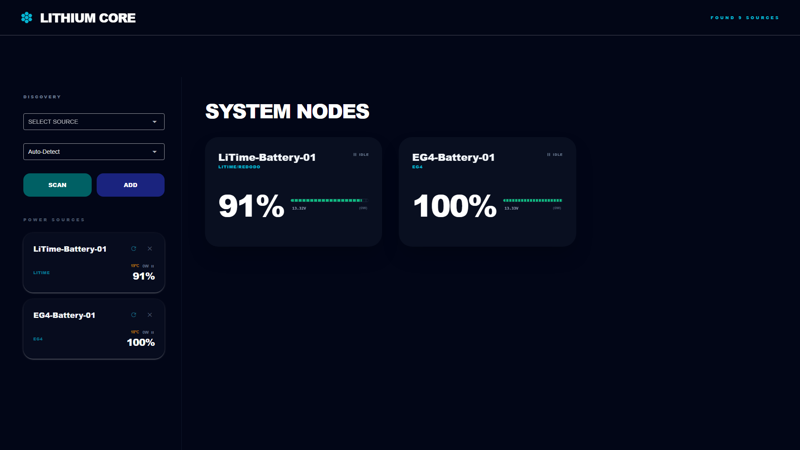
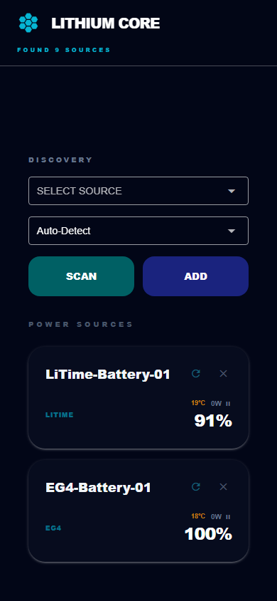

# Lithium Core

Real-time Bluetooth monitoring for **EG4**, **LiTime/Redodo**, and **JBD**-based lithium battery packs — voltage, current, cell voltages, temperature, SOC/SOH, and cycle count.

Two ways to run it:
- **Desktop** — Python app on Windows, Linux, or Mac (`run.bat` / `./run.sh`)
- **Android** — installable PWA at [dreamins.github.io/bms-dashboard](https://dreamins.github.io/bms-dashboard/), phone Bluetooth connects directly to the batteries, no server or APK needed

## Screenshots

### Desktop


### Mobile


## Features

- **Live telemetry** — voltage, current, power, state of charge, state of health, temperature, cycle count
- **Cell-level detail** — individual cell voltages with imbalance highlighting and ghost cell detection
- **Multi-battery** — monitor several packs simultaneously, each polled independently
- **Protocol support** — EG4 (Modbus RTU over BLE), LiTime/Redodo (custom binary protocol over BLE), and JBD-based packs (DD/A5 command protocol over BLE)
- **Auto-detect** — identifies battery type automatically on connection
- **Responsive UI** — sidebar + grid layout on desktop; full-screen stack on mobile
- **Dynamic grid** — detects the pack's cell count (4S, 8S, 14S, 16S, …) and adjusts the layout automatically
- **Multi-user** — per-browser-session state isolation; multiple clients can connect simultaneously
- **Auto-reconnect** — background polling loop recovers from dropped BLE connections automatically
- **Persistence** — saved batteries reload on next launch

## Requirements

- Python 3.9+
- Bluetooth adapter (any BLE-capable adapter)
- Windows, Linux, or macOS

## Quick Start

```bash
# Windows
run.bat

# Linux / Mac
./run.sh
```

The script creates a virtual environment, installs dependencies, and launches the dashboard. Open `http://localhost:8080` in your browser.

## Usage

1. Click **SCAN** to discover nearby BLE battery packs
2. Select a device from the dropdown and choose its type (or leave on Auto-Detect)
3. Click **ADD** — the battery connects and starts streaming live data
4. Click any battery card to open the full detail view with cell voltages and temperatures

**Battery not showing up in the scan?** A BMS accepts only one Bluetooth connection at a time and stops advertising while connected. Close the manufacturer's app (JBD, LiTime, etc.) — or turn off Bluetooth on your phone — and scan again.

## Running Tests

```bash
# Windows
test_all.bat

# Linux / Mac
./test_all.sh
```

208 tests covering protocol parsing contracts, BMS lifecycle, callback propagation, persistence, and UI logic.

## Mobile PWA

Open **https://dreamins.github.io/bms-dashboard/** in Chrome on Android and tap **+ Auto-Detect** (or the button for your battery type: EG4, LiTime, JBD), then pick the pack from Chrome's device list. Battery list is saved locally and reconnects automatically on next launch. iOS is not supported (Apple does not implement Web Bluetooth in Safari).

### Installing to your home screen

1. Open **https://dreamins.github.io/bms-dashboard/** in Chrome on Android
2. Tap the **⋮** menu (top-right)
3. Tap **"Add to Home screen"**
4. Tap **"Add"** on the confirmation dialog

The app icon appears on your home screen and launches full-screen — no browser chrome, no address bar, just like a native app.

The phone-side parsers are independently tested with `node docs/parsers.test.js` (62 tests, zero dependencies).

## Supported Hardware

| Manufacturer | Protocol | Cell configs |
|---|---|---|
| EG4 | Modbus RTU over BLE | 4S – 16S |
| LiTime / Redodo | Custom binary over BLE | 4S – 16S |
| JBD-based packs (tested with UPP) | DD/A5 command protocol over BLE | 4S – 16S+ |

## Project Structure

```
├── run.bat / run.sh          # One-click launch
├── test_all.bat / test_all.sh # One-click test runner
├── requirements.txt
├── dashboard_app/
│   ├── dashboard.py          # UI and application logic
│   ├── eg4_bms.py            # EG4 BLE driver
│   ├── litime_bms.py         # LiTime/Redodo BLE driver
│   ├── jbd_bms.py            # JBD BLE driver
│   ├── models.py             # BatteryData dataclass
│   └── tests/                # 208 tests
└── docs/                     # Android PWA (Web Bluetooth, vanilla JS)
```
